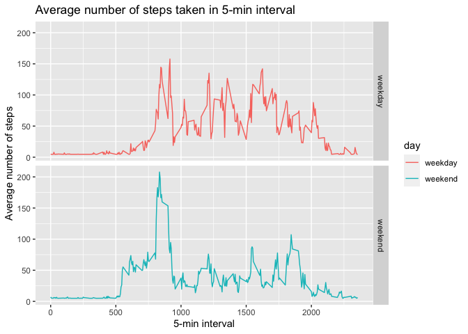

## Loading and preprocessing the data
Clean & load Libraries

```r
rm(list=ls())
library(dplyr)
```

```
## 
## Attaching package: 'dplyr'
```

```
## The following objects are masked from 'package:stats':
## 
##     filter, lag
```

```
## The following objects are masked from 'package:base':
## 
##     intersect, setdiff, setequal, union
```

```r
library(lubridate)
```

```
## 
## Attaching package: 'lubridate'
```

```
## The following objects are masked from 'package:dplyr':
## 
##     intersect, setdiff, union
```

```
## The following objects are masked from 'package:base':
## 
##     date, intersect, setdiff, union
```

```r
library(ggplot2)
```
Loading

```r
setwd("~/Desktop")
activity <- read.csv("activity.csv", header=TRUE, na.strings = "NA")
```
reasign date class

```r
activity$date <- ymd(activity$date)
```
Remove NA

```r
activityclean <- na.omit(activity)
```
## What is mean total number of steps taken per day?
Summarize data

```r
activitysum <- summarize(group_by(activityclean,date),daily.steps=sum(steps))
activitysum 
```

```
## # A tibble: 53 x 2
##    date       daily.steps
##    <date>           <int>
##  1 2012-10-02         126
##  2 2012-10-03       11352
##  3 2012-10-04       12116
##  4 2012-10-05       13294
##  5 2012-10-06       15420
##  6 2012-10-07       11015
##  7 2012-10-09       12811
##  8 2012-10-10        9900
##  9 2012-10-11       10304
## 10 2012-10-12       17382
## # … with 43 more rows
```
(Gives the total number of steps taken per day)

Plot histogram

```r
histplot = qplot(activitysum$daily.steps, binwidth = 1000, main = "Total number of steps taken each day", xlab= "Daily Steps", ylab = "Frequency", col=I("red"), alpha=I(.2), fill=I("blue"))
histplot
```

<!-- -->

Calculating Mean & Median (it is necessary to coerce to an integer)

```r
stepsmean = as.integer (mean(activitysum$daily.steps)) 
stepsmean 
```

```
## [1] 10766
```
Total number of steps taken per day is 10766

```r
stepsmedian = as.integer (median(activitysum$daily.steps))
stepsmedian 
```

```
## [1] 10765
```
Total number of steps taken per day is 10765

## What is the average daily activity pattern?
Summarize data

```r
aveday <-summarize(group_by(activityclean,interval),mean.steps=mean(steps))
```
Plot average number of steps by 5-minute interval

```r
seriesplot <- ggplot(data = aveday, aes(x = interval, y = mean.steps)) + geom_line(color="red")+ labs(title="Average Number of Steps Taken vs 5-min Interval", y="Average Number of Steps", x="5-min Interval")
seriesplot
```

<!-- -->

Calculating which 5-minute interval,contains the maximum number of steps

```r
maxposition <- which.max(aveday$mean.steps)
peak <- aveday$interval[maxposition]
peak 
```

```
## [1] 835
```
Maximum number of steps is 835

## Imputing missing values
Calculating missing values

```r
sum(is.na(activity)) 
```

```
## [1] 2304
```
Total number of missing values in the origina dataset is 2304

Devise a strategy for filling in all of the missing values in the dataset:
NA's will be substituted by the steps' mean value (without NA's)

```r
filled.activity <- activity
filled.activity$steps[is.na(filled.activity$steps)] <- mean(filled.activity$steps,na.rm=TRUE)
```
Create a new dataset that is equal to the original dataset but with the missing data filled in

```r
colSums(is.na(filled.activity)) # To check there is no "NA's"
```

```
##    steps     date interval 
##        0        0        0
```
To check there is no "NA's"

Creating New Histogram:

Summarize data

```r
filled.activity2 <- summarize(group_by(filled.activity,date),daily.steps=sum(steps))
```
Calculating the Mean

```r
mean.filled   <- as.integer(mean(filled.activity2$daily.steps))
mean.filled 
```

```
## [1] 10766
```
Mean = 10766

Calculating the Median

```r
median.filled   <- as.integer(median(filled.activity2$daily.steps))
median.filled 
```

```
## [1] 10766
```
Median = 10766

Plotting

```r
histplot2 = qplot(filled.activity2$daily.steps, binwidth = 1000, main = "Total number of steps taken each day", xlab= "Daily Steps", ylab = "Frequency", col=I("red"), alpha=I(.2), fill=I("blue"))
histplot2
```

<!-- -->

After NA's substitution, the Mean and Median become the same. 
Filling with mean values make the histogram more normally distributed.

## Are there differences in activity patterns between weekdays and weekends?
Create a new factor variable in the dataset with two levels – “weekday” and “weekend”

```r
filled.activity$day <- ifelse(weekdays(filled.activity$date) %in% c("Saturday","Sunday"), "weekday", "weekend")
```
Preparing data for ggplot (Summarizing)

```r
filled.activity2 <- summarize(group_by(filled.activity,interval,day),steps.mean=mean(steps))
```
Plotting

```r
weekday.interval <- ggplot (filled.activity2, aes(x=interval, y=steps.mean, color=day)) + facet_grid(day~.) + geom_line() + labs (title="Average number of steps taken in 5-min interval", y="Average number of steps", x="5-min interval")
weekday.interval
```

<!-- -->


